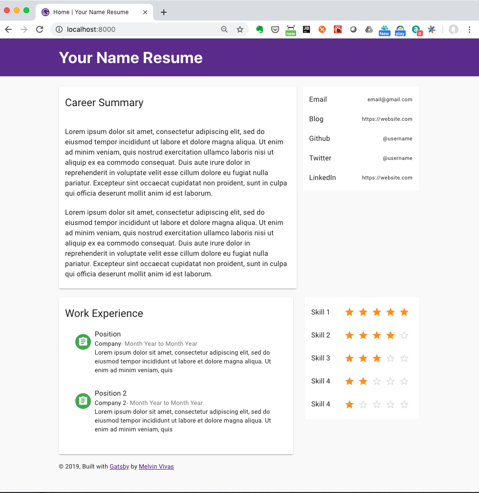

<!-- AUTO-GENERATED-CONTENT:START (STARTER) -->
<p align="center">
  <a href="https://www.gatsbyjs.org">
    
  </a>
</p>
<h1 align="center">
  Online Resume - Gatsby Starter
</h1>



This is a starter to create your online resume.

## 🚀 Quick start

1.  **Edit the data to be populated for your resume**

    You can edit the following files:

    1.  **`src/data/summary.json`**: This data file is used to populate the Summary section.

    2.  **`src/data/contact.json`**: This data file is used to populate the Contact section.

    3.  **`src/data/experience.json`**: This data file is used to populate the Experience section.

    4.  **`src/data/skill.json`**: This data file is used to populate the Skills section.

1.  **Start developing.**

    Navigate into your new site’s directory and start it up.

    ```sh
    cd donvito-gatsby-resume-starter/
    gatsby develop
    ```

1.  **Open the source code and start editing!**

    Your site is now running at `http://localhost:8000`!

    _Note: You'll also see a second link: _`http://localhost:8000/___graphql`_. This is a tool you can use to experiment with querying your data. Learn more about using this tool in the [Gatsby tutorial](https://www.gatsbyjs.org/tutorial/part-five/#introducing-graphiql)._

    Open the `donvito-gatsby-resume-starter` directory in your code editor of choice and edit `src/pages/index.js`. Save your changes and the browser will update in real time!


Looking for more guidance? Full documentation for Gatsby lives [on the website](https://www.gatsbyjs.org/). Here are some places to start:

## 💫 Deploy

[](https://app.netlify.com/start/deploy?repository=https://github.com/donvito/donvito-gatsby-resume-starter)

<!-- AUTO-GENERATED-CONTENT:END -->
